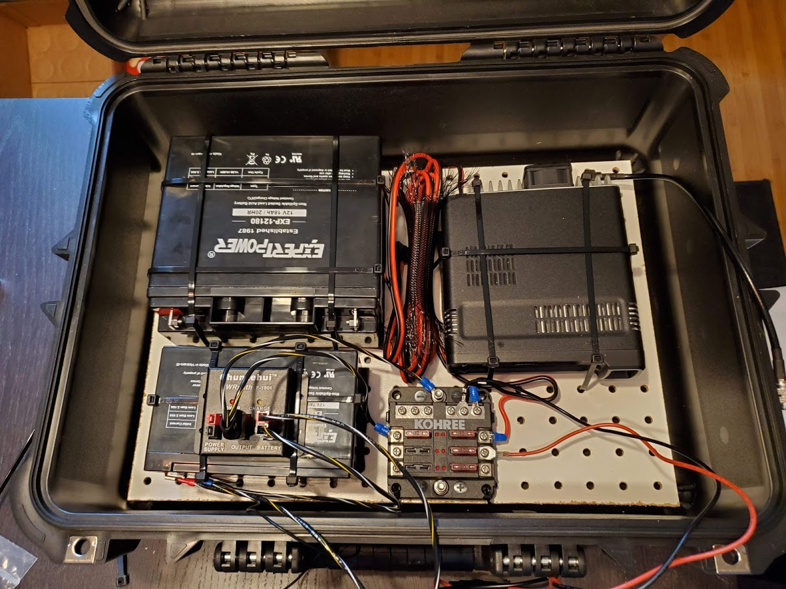
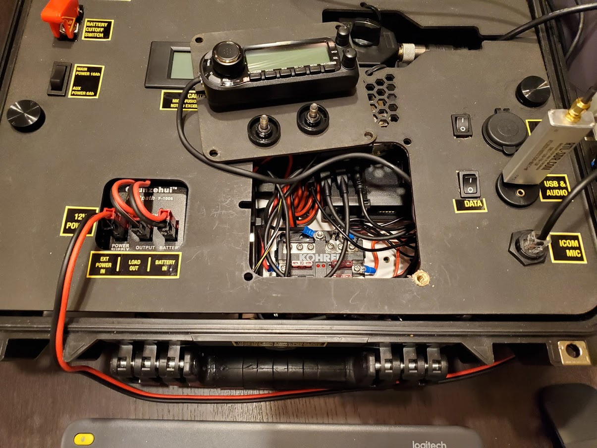
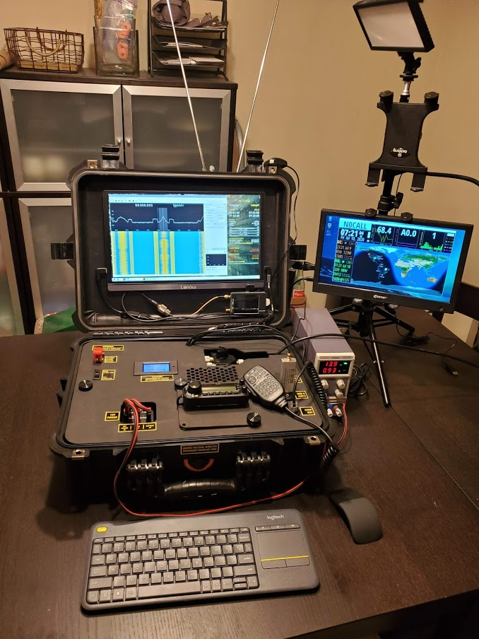
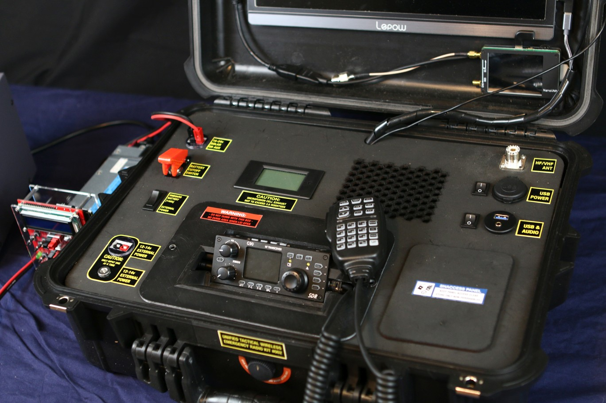
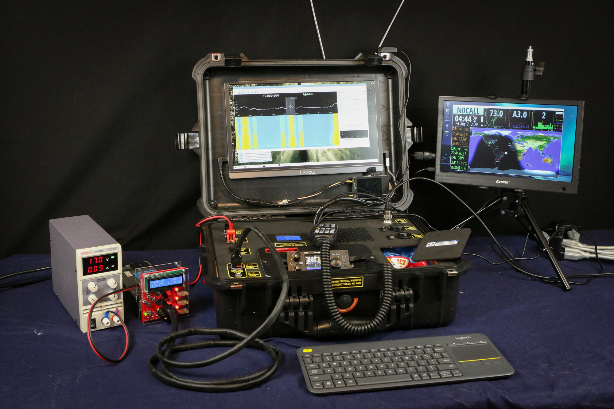
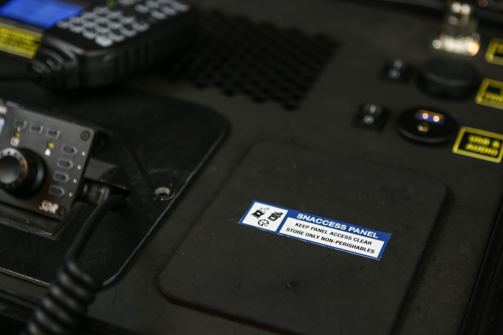

# Gallery

 A smattering of TWERKstation photos, specifically kit serial #002

# Version 1: Gotta Start Somewhere

Selected an affordable plastic carrying box, pulled out the foam and cut a pegboard to the proper size. Used the open-cell foam I had pulled out as a cushion for the radio and batteries before gently snugging them down with zip-ties.

The main panel has a smaller panel than can be flipped over to keep the remote radio face from cracking the LCD screen secured in the lid.

The kit up and running. Left monitor displays SDR waterfall, right monitor is hamclock.

# Version 2: The Journey Toward Data Modes

Data TWERKstation upgrade in progress (can only receive in data modes, voice transmitting untested):

Kit powered up on external power (provided by Schenktronics Power Brigand). Left monitor displays SDR waterfall and supplies audio via HDMI. Monitor on the right displays hamclock.

A photo of the Snaccess Panel suitable for a desktop wallpaper.

