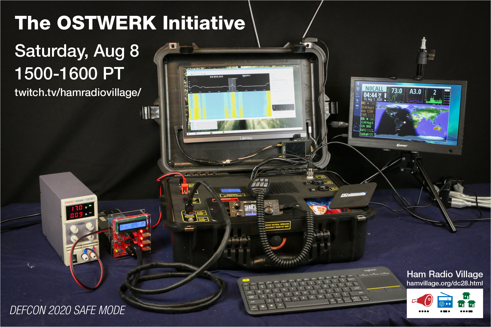

# TWERKbench.org

## Open Source Tactical Wireless Emergency Radio Kits for Everyone

Welcome! We're just a handful of amateur radio enthusiasts who are intersted in the planning and construction of portable amateur radio kits.

## Here's a long overview of what we hope to accomplish:

### [Whitepaper](https://drive.google.com/file/d/1gdGEZOfxyZXp93f904cmVDvobUkqpY-R/view?usp=sharing)

## A small gallery of images (the initiative is very new!)

### [Gallery](gallery/index.md)

## A link to the TWERKbench Discord server:

### [Discord Server](https://discord.com/invite/7uPH6Aw)

## See a presentation about the OSTWERK Initiative at DEFCON 2020 Safe Mode!

