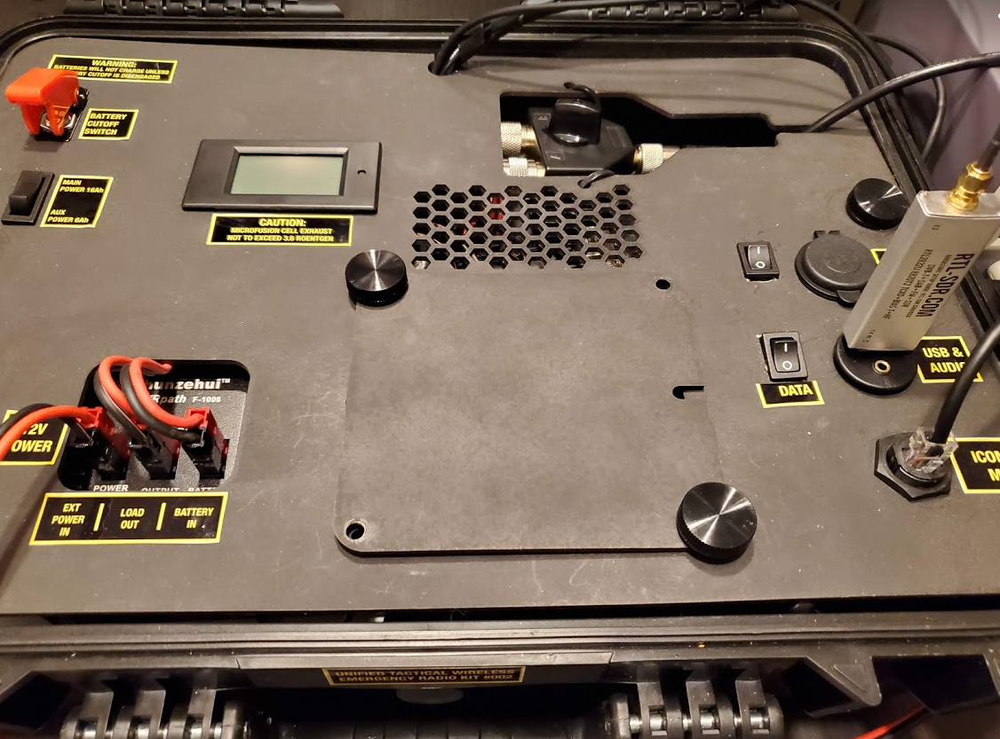
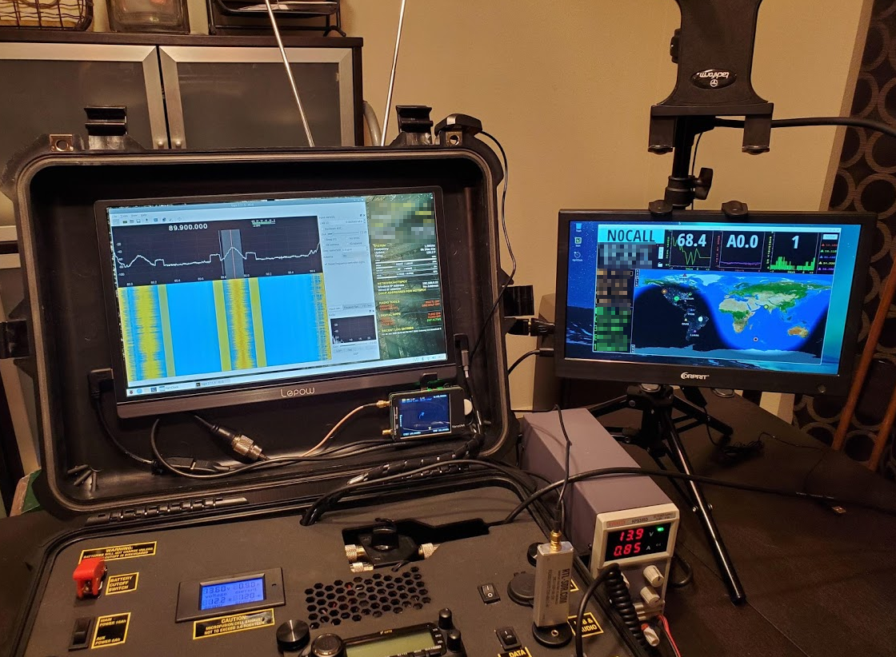
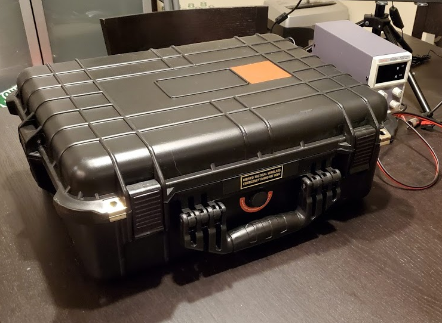
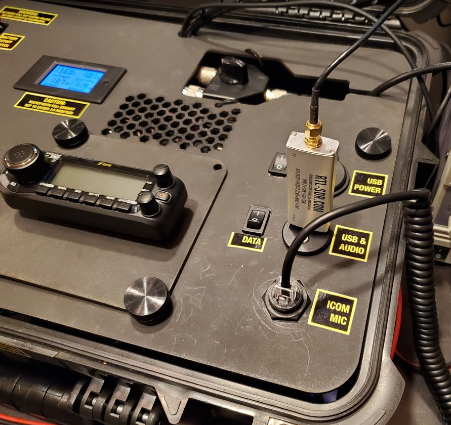

**The OSTWERK Initiative**

http://twerkbench.org

# Open Source Amateur Radio Go-Kits for Everyone

# Project Overview

In amateur radio, there is a surprising depth to the types of voice modes, data operations, satellite operations… the list can go on and on. For someone new to ham radio, it can all be a lot to take in and plan for. Which radio is the best radio for what you want to get into? Which slice of the ham radio hobby can be tailored to fit your interests? How can your knowledge and experience help others?

## Tactical Wireless Emergency Radio Kit

 A Tactical Wireless Emergency Radio Kit (or TWERK, or TWERKstation) is an open source hardware kit that leverages the strengths of the owner to fill a niche in an amateur radio environment.

### Customizable Hardware

While each TWERK is customized by their owner, every TWERK fills a specific need and is compatible with other TWERKstations. Whether you’re relaying voice messages into or out of a disaster zone, setting up a data network node, keeping track of contacts during a contest, or administering a TWERKstation Parliament, each kit is custom-built by the owner to be dependable not only for casual use, but for emergency situations as well.

## TWERKbench.org

A big part of this open-source project is to encourage collaboration between those with experience with their kits and those who are new to the hobby or making a “lateral upgrade” with their kit (an example is going from a voice kit to a data kit by adding a Raspberry Pi computer and LCD monitor). TWERKbench.org will act as a hub for the community; a place that people who are interested can be directed to find out more about kits and amateur radio.

### I can’t do this alone!

I’m not a web developer, and I have no idea how internet stuff works beyond HTML &lt;body> tags. I also have a mortgage and not a ton of money. I need a team of volunteers I can trust to work with the amateur radio community and make this dream a reality. \

# Details

The Open Source Tactical Wireless Emergency Radio Kit Initiative has three parts: TWERKstations, the TWERK online platform, and the TWERKsmith Code of Conduct.

### The TWERKstation

A true TWERKstation follows six principles:

* OPEN SOURCE
  * A TWERKstation is fashioned from off  the shelf parts, or parts that can be constructed in an average workshop stocked with household tools (drill, saws, screwdrivers, etc). If you see a TWERKstation that is “cool” or “rad”, there should be a list online of the components needed to build a copy for yourself.
* TACTICAL
  * A TWERKstation can easily work with other TWERKstations to form a group or “Parliament” of TWERKs. TWERK power is supplied and received through standard Anderson Powerpole connectors, so homemade battery and solar kits are compatible. A TWERK also has a moderate level of durability.
* WIRELESS
  * A TWERKstation can work for at least six hours in an off-grid situation. This may be a little less under a heavy duty cycle, but a ballpark time for average kit operation when choosing a battery. More is better, but balance cost and weight.
* EMERGENCY/EVERYDAY
  * A TWERKstation is kept for emergency use, and with active or passive cooling solutions can be used every day. This guideline is a little loose, and mostly added because the acronym needed a vowel.
* RADIO
  * The beating heart of almost every TWERKstation is the radio. This is usually the most expensive part of the kit, and a lot goes into choosing the kit radio. Do you need a radio with a wide data mode compatibility? Something to account for doppler shift when working satellites? Working digital voice modes? There’s a radio out there for almost every need, and if you haven’t found yours, then let us help you.
* KIT
  * A TWERKstation is custom built to be all-in-one.  Power and radio at a minimum, with all kinds of gadgets and hardware to add on to fit your specialty or your personality. Usually built in a rugged case to protect against elements and shock, a TWERK can be folded or sealed up for transport and deployed when needed.

### The TWERK Online Platform

The online platform TWERKbench.org would host a forum where users can discuss what works in their kits and what doesn’t, and those new to the hobby can have a safe place to ask questions and feel assured that the purchases they make are the right ones.

In a perfect world, the online platform would have a system similar to pcpartpicker.com, where people could post builds, and others can rate and comment, and even build their own copy with their own spin on it. Ideally, the site could also track and total the mAH consumption rate of chosen components at average/max duty cycle, making it easy for kit designers to budget their power effectively.

Hopefully, there could be a map where TWERKstation owners could see others in their grid square, to aid with coordination for Field Day activities or disaster coordination. Also, TWERKstation owners could coordinate with local disaster management and have a place to arrange to meet during a disaster to help provide support.

### TWERKsmith Code of Conduct

* _A TWERKsmith should be courteous_: If done right, a TWERKstation should attract attention from the type of people we want to add to the amateur radio ranks. You should be ready to field questions about your kit and the ham radio hobby in general with a bare minimum of enthusiasm.
* _A TWERKsmith should be competent_: Know the limits and capacities of your kit, and you should always know about how much power you have left in an off-grid situation, and how to budget it effectively.
* _A TWERKsmith owner should value community_: Know your nearby TWERKstation owners and what their capabilities are. Should disaster strike, see what you can do to team up and provide comfort or relief to those affected around you.
* _A TWERKsmith should value their own personal honor_: A true TWERKsmith will never cheat a contest or reveal the contents of the MYSTERY BOX.
* _A TWERKsmith should show off their work_: Many other people are interested in seeing what you’ve created, and how it fits into your personal lifestyle and use case. Post your creations so that others with similar interests can reap the rewards of your effort.
* _A TWERKsmith should strive for improvement:_ A TWERKstation can be built to be cheaper, more power efficient, have a longer reach, process a wider variety of data modes, look “cooler”, only use used parts, etc. How you build and use your TWERKstation is up to you, but always keep in mind that your TWERK is a jumping off point for greater things.

### TWERKathalon

The TWERKathalon is a real-life contest that puts the readiness and ingenuity of the amateur radio community on display. Each year, teams of 2-4 race against the clock to carry their TWERKstations through a simulated post-disaster obstacle course and then successfully relay traffic at the end through a judging station.

Courses would be about 30’x50’, and course plans would be released ahead of time if teams wanted to practice. Obstacles are crafted from 2x4’s and plywood for as little cost as possible. Costumes and theme teams are allowed, and teams are encouraged to come up with creative solutions for overcoming obstacles, so long as they follow basic course rules. Teams can score bonus points by bringing as many amp-hours with them to the finish line as they want.

# TWERKstation Types:

### Voice

* Very common type of kit, easy to make
  * Used Radio & SLA Battery in durable box
* Accessible to Tech licenses (2m/70cm)

### Satellite Communications

* Rado kit for satellite interfacing
* Usually paired with special antenna kit

### Data Modes

* Contacts & relays messages through data modes
* Computer on board (RasPi/laptop/other)

### Morse Code / HF

* Can be voice or data
* Usually 10-160 meters

### Troubleshooter

* Variety of power/antenna connectors stowed on board, possibly antenna analyzer
* Duct tape and zip ties aplenty
* Utilitarian HT radio, monitors simplex
* Remember to thank/reimburse/bribe your troubleshooter!

### Net Operations

* Radio-optional computer-toucher kit
* Makes sure all the TWERKstations play nice
  * Networking for contest logging, etc.
* Power Comptroller: can budget Parliamentary power needs off-grid

### MYSTERY BOX

* I will never reveal the contents of the MYSTERY BOX
* Neither will you

### The Llama

* The “one with everything”, tries to do too much
* Heavy, bulky, and sometimes fragile, llama owners should be ridiculed
* ...but then thanked if their extra crap comes in handy

### Power

* The lifeblood of the operation, extra electricity makes everything go
* Charged off grid or solar, supplies 12v to TWERKstations
* Usually no radio on board beyond a cheap HT

### Antenna

* Some kind of wire, mast, feed line, etc. used to broadcast and receive a signal
* Collapsible into transportable kit form
* Kit should be labeled as to which type of antenna (band/mode/structure/etc)

# Sample TWERKstation

What follows is a TWERKstation I have assembled myself. With a main _and_ auxiliary lead-acid battery, dual monitor, onboard NanoVNA with UHF switch, and 2m/70cm mobile radio, this kit is definitely a llama. At 37 pounds, I’m not lugging this thing more than the minute it takes to get it out of the back of my car to a nearby folding table.

### A Quick Tour

Sealed up in a Harbor Freight utility case, this TWERKstation is watertight and dustproof when the latches are engaged. There are no external access ports; the kit must be deployed to charge, attach antennas, etc. The smooth orange vinyl square on the top is where the suction cup antenna adheres to for the RTL-SDR.

Deployed, but powered down, this TWERKstation has a loose wireless keyboard, mouse, and radio microphone. Hopefully those can be tethered in the future to avoid ‘rattle damage’. The switches and thumbscrews in the kit do a good job of keeping everything from sliding around during transport.

On the main panel is a smaller panel held on with two thumbscrews. Removing the thumbscrews and flipping over the panel reveals the main radio faceplate adhered to the back of the panel. The panel can then be secured back down with the thumbscrews and the cord fed through the slot on the left.

On the top left is the battery cutoff and selector switches, and power information display. Flipping up the red cover exposes the switch and turns on the internal batteries. The lower switch selects between a 16Ah and 6Ah heavy lead-acid batteries. Right now, the kit is on external power, so the battery cutoff is engaged.

On the right hand side of the kit, from front to back, is the microphone passthrough, a USB and ⅛” headphone jack passthrough to the RasPi inside, and a pair of USB power ports for charging phones or powering small USB gadgets. In the back near the lid is the antenna selector switch used to switch the antenna between the radio and the NanoVNA antenna analyzer.

Rounding out the tour is the lower left, where the power distribution block is. I use a PWRpath to regulate power between external power, the batteries, and the fuse block. In a pinch, I like having a direct connection to the battery if I need it, and I like the automatic failover to battery power when external power fails.

Here I’ve booted up the onboard Raspberry Pi 4, with dual HDMI out. I’m running the RTL-SDR on one screen, and hamclock on the other. The main kit monitor is secured to the inside of the lid using 3M Command Strips. I’ve secured a second monitor to a short lighting tripod using a gripper clamp used to clip ipads to exercise bikes. I probably won’t have the second monitor in the field, unless I can be guaranteed an external power connection.

### Potential Upgrades

A true TWERKstation operator is always thinking about how to improve their kit. A TWERKstation can be improved in so many ways. What can be done to reduce weight? What can be done to improve power storage or renewal? Is there a new mode you’re interested in that your radio doesn’t support? Did you just see something awesome in another TWERKstation that you absolutely must have?

Here’s an example of what’s going through my head with my kit:

* The radio I have now is an alright entry level radio. I would like to upgrade to a Xiegu G90 because my true interest is in HF data, like FT-8.
  * That means designing something to house the faceplate of the G90 on the main panel
* The batteries I have are way too heavy. I have a few extra bucks, so I can afford to upgrade to LiFePO4 batteries to save on some weight.
  * That means ripping out the lead-acid power infrastructure to support a different battery charging chemistry
* I discovered a rad powerpole panel mount on thingiverse that I want to integrate
  * [https://www.thingiverse.com/thing:2580868](https://www.thingiverse.com/thing:2580868)
    * Need one for solar/aux power in, and another one for a connection to a fuse on the block for power out
* All this re-arranging means needing to cut a new main panel

# Glossary

* **Kit Recipe** - Instructions on how to replicate a TWERKstation; recipe should include the kit’s current draw at receive only and 50% duty cycle
* **Mystery Box** - A container that may or may not exist, within which anything could be housed; rumors or discussion about the MYSTERY BOX are frowned upon
* **Parliament** - A group of TWERKstations united toward a single cause
* **TWERKsmith** - (see TWERKstationeer)
* **TWERKstation** - A somewhat-durable custom-built open-source all-in-one kit for emergency or everyday radio communications
* **TWERKstationeer** - One who has built their own TWERKstation
